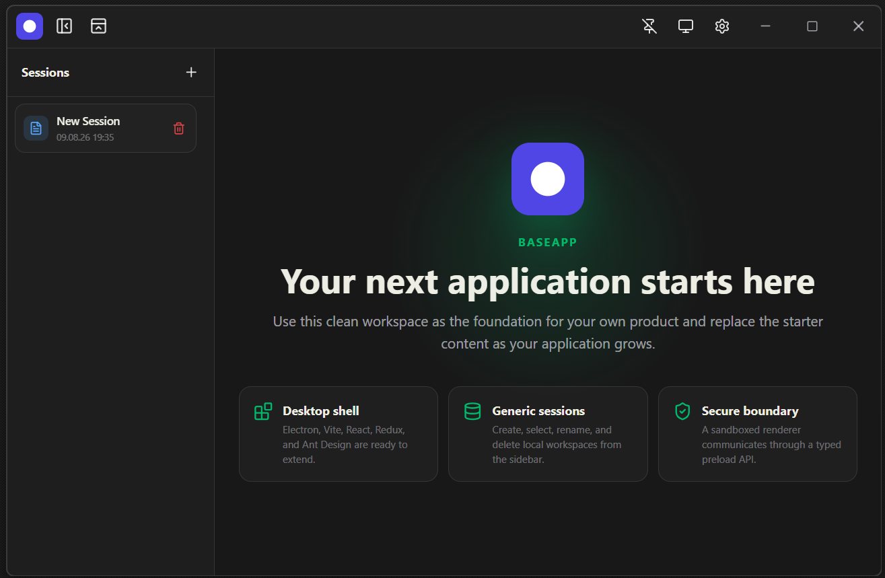
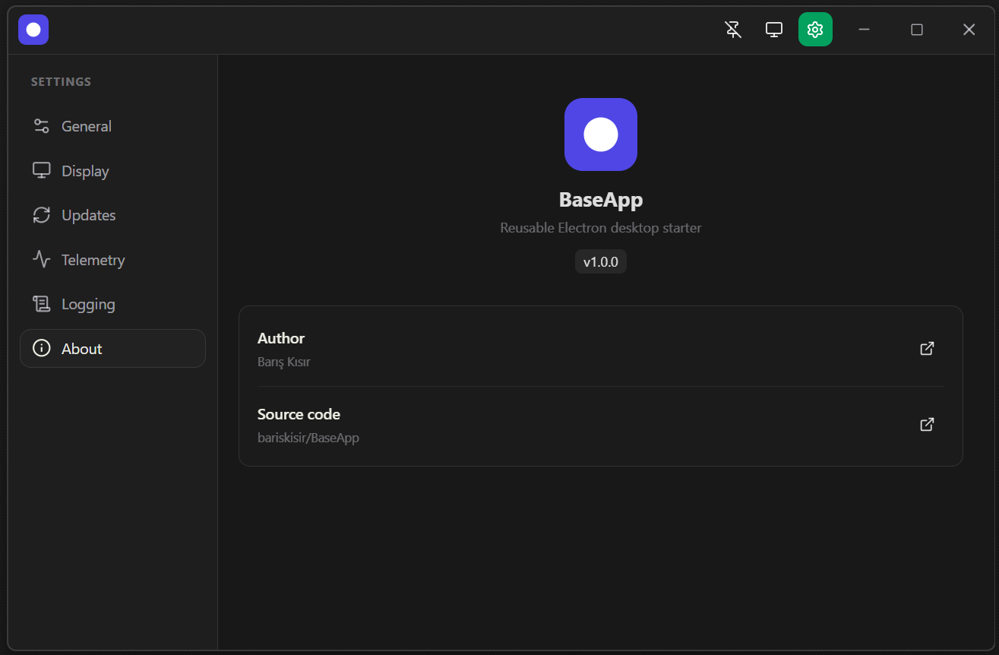

<p align="center">
  
</p>

<h1 align="center">BaseApp</h1>

<p align="center">
  A secure, reusable Electron desktop application starter.
</p>

<p align="center">
  <a href="https://github.com/bariskisir/BaseApp/actions/workflows/ci.yml"></a>
  <a href="https://github.com/bariskisir/BaseApp/releases/latest"></a>
  <a href="LICENSE"></a>
</p>

<p align="center">
  
  
</p>

## Features

- **Reusable desktop shell**
  - Electron, React, TypeScript, Redux Toolkit, Ant Design, and Vite are wired into a ready-to-extend starter.
  - A hardened main/preload/renderer boundary keeps Node.js and Electron capabilities out of the renderer.
  - Single-instance handling restores the existing window instead of opening duplicate application instances.
  - Window size, position, maximized state, and fullscreen state are restored only when they still fit a connected display.

- **Generic session workspaces**
  - The left session panel supports creating, selecting, renaming, deleting, and deleting all local workspaces.
  - The panel can be resized within safe sidebar/workspace limits and remembers its width across restarts.
  - Each session provides a generic data object that downstream applications can extend with their own domain model.
  - Delete actions are disabled for the final empty session; other final-session and bulk deletions create a clean replacement.
  - Session and settings writes are serialized to prevent rapid operations from overwriting each other.

- **Compact mode**
  - Hides session and global navigation surfaces for a distraction-free workspace.
  - Remains available from the titlebar and exits automatically when the user leaves the home workspace.

- **General settings**
  - Interface localization for English, Turkish, German, French, Portuguese, Chinese, Spanish, Russian, Japanese, and Korean.
  - Configurable 12-hour or 24-hour session timestamps with four-digit years.

- **Display settings**
  - System, light, and dark themes with synchronized native window chrome.
  - Top or left global navigation placement.
  - Page zoom from 50% to 200% in 10% steps.
  - Always-on-top control, optional system tray icon, and minimize-to-tray-on-close behavior.
  - Green application controls and separate blue session icon tokens are ready for downstream branding.

- **Updates**
  - **Automatic updates:** enabled by default for packaged builds and checks the latest stable GitHub Release during startup.
  - **Manual checks:** can be started from Settings and report checking, download progress, availability, errors, and release notes.
  - **Verified downloads:** Windows selects the exact x64 or arm64 NSIS installer, validates its size, and verifies its SHA-256 digest when GitHub provides one.
  - **Unattended updates:** disabled by default and available only while automatic updates are enabled. When opted in, a downloaded Windows installer runs silently and reopens the updated application.
  - **Attended installation:** when unattended updates are off, the downloaded installer waits for the user to choose **Install now**.
  - **macOS and Linux behavior:** reports the available release page instead of attempting to run a Windows installer.

- **Privacy-bounded telemetry**
  - Disabled by default so cloned projects do not send telemetry until their owner explicitly opts in.
  - Sends at most one Application Insights startup event per process when enabled.
  - Limits the payload to application version, platform, locale, and a durable anonymous installation identifier; session content is never included.
  - Uses `APPLICATION_INSIGHTS_CONNECTION_STRING` from the process environment when present and otherwise falls back to the value in `src/shared/appInfo.ts`.
  - Telemetry can be disabled from Settings and network failures do not prevent application startup.

- **Diagnostics and logging**
  - Daily general and warning/error log files with bounded retention.
  - Configurable error, warning, info, debug, and verbose levels.
  - Renderer diagnostics cross a typed IPC bridge, and the log directory can be opened directly from Settings.

- **Security defaults**
  - Context isolation, renderer sandboxing, disabled Node integration, denied permission requests, and blocked popups.
  - A typed IPC contract shared by the preload bridge and the main process, with sender checks and schema validation applied to every privileged command.
  - Allow-listed renderer navigation and external URLs.

- **Starter-friendly engineering**
  - Central application identity and telemetry fallback configuration in `src/shared/appInfo.ts`.
  - Strict TypeScript, Zod validation, SCSS Modules, typed localization resources, Biome linting, Prettier formatting, and Vitest coverage.
  - Push/PR verification, Dependabot updates, and a separate tagged-release workflow.
  - Windows x64/arm64 NSIS, macOS x64/arm64 DMG, and Linux x64/arm64 AppImage packaging commands.

---

## Use BaseApp as a starter

Create a repository from this project or clone it, then complete this checklist before publishing your own application:

1. Update the identity and project links in [`src/shared/appInfo.ts`](src/shared/appInfo.ts).
2. Update `name`, `productName`, `appId`, author, repository, homepage, and issue links in [`package.json`](package.json).
3. Replace the SVG, PNG, and ICO files in [`build/`](build/) and replace the screenshots in [`images/`](images/).
4. Update the application name, tagline, workspace copy, and any new feature text in the locale resources under [`src/renderer/src/i18n/locales/`](src/renderer/src/i18n/locales/).
5. Replace the Application Insights fallback or keep telemetry disabled. A runtime `APPLICATION_INSIGHTS_CONNECTION_STRING` environment variable takes precedence over the checked-in fallback.
6. Extend `SessionData`, its Zod validation, IPC contracts, Redux state, workspace UI, and tests together when adding domain data.
7. Review installer signing, macOS notarization, telemetry consent, privacy disclosures, and update behavior before distributing builds.
8. Update README badges, screenshots, release links, `LICENSE`, `SECURITY.md`, and repository settings for the new project.

Changing `APP_NAME` also changes the application-data directory used by new builds. Existing local data is not migrated automatically across renamed applications.

## Requirements

- Node.js 24 or newer
- npm 11 or newer
- Windows, macOS, or Linux for development
- The target operating system for native installer production; signing and notarization require platform-specific credentials

## Development

```bash
git clone https://github.com/bariskisir/BaseApp.git
cd BaseApp
npm ci
npm run dev
```

| Command | Purpose |
| --- | --- |
| `npm run dev` | Start Vite and Electron with renderer hot reload |
| `npm start` | Build and launch the production Electron bundles locally |
| `npm run verify` | Run lint, tests, format checking, type checking, and a production build |
| `npm run test` | Run the Vitest suite once |
| `npm run test:watch` | Run Vitest in watch mode |
| `npm run lint` | Run Biome linting |
| `npm run format` | Format code files with Prettier |
| `npm run typecheck` | Type-check main/preload/tests and renderer projects |
| `npm run build` | Type-check and build renderer, main, and preload bundles |

## Architecture

```text
src/
├── main/       Electron lifecycle, storage, updates, telemetry, tray, and window security
├── preload/    Capability-limited contextBridge API exposed as window.app
├── renderer/   Sandboxed React UI, Redux state, settings, sessions, and localization
└── shared/     Serializable types, IPC channels and payload contracts, identity, and shared configuration
```

The renderer cannot access Node.js, Electron, or the filesystem directly. New privileged capabilities should be implemented in the main process, exposed through a narrow preload method, validated at the IPC boundary, and represented in shared types.

Durable settings, sessions, telemetry identity, logs, and window state are stored below the operating system's application-data directory. Chromium runtime files are isolated from durable application data.

## Packaging

| Command | Output |
| --- | --- |
| `npm run package` | Unpacked application directory for the current platform |
| `npm run package:win` | Windows x64 and arm64 NSIS installers |
| `npm run package:mac` | macOS x64 and arm64 DMG images |
| `npm run package:linux` | Linux x64 and arm64 AppImages |

Architecture-specific variants are available as `package:win:x64`, `package:win:arm64`, `package:mac:x64`, `package:mac:arm64`, `package:linux:x64`, and `package:linux:arm64`.

Tagged `v*` pushes run the release workflow for Windows and Linux artifacts. Ensure the tag exactly matches the version in `package.json`. The included installers are unsigned starter outputs; production applications should configure code signing and macOS notarization.

## Security

The starter uses sandboxed renderers, context isolation, disabled Node integration, restrictive navigation and popup policies, a Content Security Policy, main-frame IPC validation, and allow-listed external URLs. See [SECURITY.md](SECURITY.md) for private vulnerability reporting guidance.

## License

[MIT](LICENSE)
